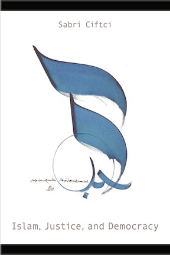
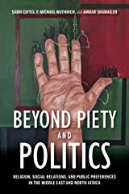
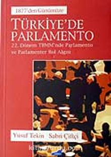

### *Islam, Justice, and Democracy*
Temple University Press, 2021

This book explores the lineages of political and social justice discourses to explain Muslim political attitudes. It combines historical and empirical treatments of the subject to provide a fuller account of scholarly inquiry concerning Islam and democracy. Focusing on Muslim agency and putting values at the center of inquiry, it argues that different conceptions of justice have significant sway on the political attitudes of the devout.

[[Publisher Page]](https://tupress.temple.edu/books/islam-justice-and-democracy) &nbsp; [[Amazon]](https://www.amazon.com/author/sabriciftci)

---

### *Beyond Piety and Politics*
Indiana University Press, 2022

This book posits the existence of general socio-religious spatial positions with distinct outlooks within the domain of those categorized as "religious" Muslims, moving away from dichotomous binaries like "religious/non-religious" or "secular-Islamist." Drawing on economics of religion, sociological theories of moral cosmology, and empirical research on Muslim political attitudes, it examines synergies between religion and political and economic preferences.

[[Publisher Page]](https://iupress.org/9780253060532/beyond-piety-and-politics/) &nbsp; [[Amazon]](https://www.amazon.com/author/sabriciftci)

---

### *Türkiye'de Parlamento (Parliament in Turkey since 1876)*
Siyasal Kitabevi, 2007

This book in Turkish examines the history of the Turkish Grand National Assembly from its establishment in 1876 through the late twentieth century. It traces the institution across different constitutional eras and regime types — from the constitutional monarchy to the republic, through single-party and multiparty periods — and analyzes the recurring episodes of parliamentary suspension and closure throughout Turkish political history.

