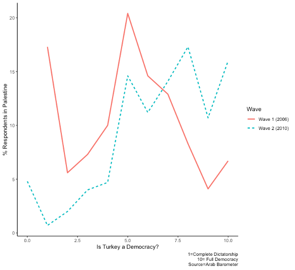

In my last post, I discussed the reasons behind Erdogan's popularity in the Arab World by focusing on anti-Americanism and religious party support. In this post, I am looking at Palestine as an element of Turkish foreign policy. Once again, I will deploy some data from the fifth wave of the  👉 [**Arab Barometer**](https://www.arabbarometer.org). For those who want to learn more, I have written a book chapter on this subject  👉 [**Here**](https://www.researchgate.net/publication/338686621_Soft_Power_Domestic_Dividends_and_Turkish_Foreign_Policy_The_Case_of_Palestine), which is hopefully coming out soon. 

The condition of Palestine has been a significant political issue filled with emotion, conflict, and drama. Being a champion of the Palestinian cause is expected to pay domestic and international political dividends in any Muslim-majority country. In the past, Middle Eastern leaders like Nasser, Saddam Hussein, and Khomeini exploited this issue to gain popularity at home and abroad. Recep Tayyip Erdogan is no exception to this pattern. Coming from an Islamist background, he did not hesitate to exploit the Israeli-Palestinian conflict after his Justice and Development Party (AKP) rose to power in 2002. More significantly, however, it was the one-minute crisis in Davos that put Palestine at the center of Turkey's domestic and international politics. Some observers view this event as a paradigm shift in Turkish foreign policy. I disagree. When placed in the long-term foreign policy context and considering the facts on the ground, the event, while significant or might be described as rupture, does not constitute a paradigm shift. In the past, Turkish administration has implemented a cautious, carefully-balanced foreign policy strategy about Palestine. This strategy was built on dual recognition of Israel and Palestine. It was used as a leverage in international arena either to advance Turkey's security or improve its relations with the West or the Middle East. The fact that Turkish-Israeli trade relations improved after a short hiatus in the post-Davos era is evidence that Turkey continues to pursue a two-sided policy about Palestine. Nonetheless, one-minute crisis is still significant in several fronts. First, while Palestinian independence has been employed as a rallying point by the Turkish leftist groups in the past, it served to the Islamist agenda in AKP era. An Islamist-leaning government utilized it as a rally-around-the-flag dynamic to gain domestic political dividends. More importantly, Palestine became the centerpiece of Turkish soft power strategies through symbolic actions and humanitarian aid projects. Finally, AKP leaders made the Palestinian issue (Filistin meselesi) an essential element of boosting Turkey's international image, particualrly in the Middle East. It is the last two points I want to elaborate on now, again bringing some evidence from the Arab Barometer and also from the reports of [**TIKA (Turkish Cooperation and Coordination Agency)**](http://www.tika.gov.tr/en). 

Palestine is one of the countries where Erdogan enjoys widespread popularity. The approval of Turkish foreign policy is also quite high (see the first post on the subject). Is this related to changing winds in Turkey's foreign policy about Israel and Palestine? I will say "most probably," especially given how unpopular Israel is in the region. Check Figure 1, which shows the percentage of respondents who view certain countries as the greatest threat to their nations according to the Arab Barometer. These percentages should be considered in the context of the whole picture. The relevant survey question invokes more than a dozen countries as possible threats to one's country. As Figure 1 shows, a large portion of the respondents view Israel as the greatest threat (green bars) within a crowded field including US, Russia, China, Iran, and EU.  This is remarkable for providing insights about the security calculations in the minds of ordinary people.  Israel also leaves behind two notable contenders, US and Iran. Citizens in Palestine, Jordan, Lebanon, and Egypt are especially likely to view Israel as a threat. Turkish foreign policy enjoys remarkable approval in the first two but not so much in the last two cases. Hmmm...🤔, what is going on here? 

```{r dataprep, include=FALSE}
##Blog II entry
##Read AB V

library(tidyverse)
library(foreign)
library(expss)

ab5<-as_tibble(read.dta("/Users/sabri/Dropbox/ABprojects/tr.image/ABV_Release_Data.dta"))

#subset for blog 1
ab5s<-select(ab5, country,  Q725_3, Q7141A)

ab5s=apply_labels(ab5s, Q725_3="Erdogan's Foreign Policy", country="Country",
                  Q7141A="Biggest Threat to my Country")
##replace missing values with NA
ab5s$efp<-dplyr::recode(ab5s$Q725_3, "very good"="Turkish Foreign Policy: Favorable", "good"="Turkish Foreign Policy: Favorable",  
                        "bad"="Turkish Foreign Policy: Unfavorable",  "very bad"= "Turkish Foreign Policy: Unfavorable")

ab5s<- ab5s %>% dplyr::na_if("don't know")
ab5s<- ab5s %>% dplyr::na_if("refused")

tdt<-ab5s %>% group_by(country, Q7141A) %>% summarise(count=n()) %>%mutate(percent=count/sum(count)) %>%  filter(Q7141A %in% c("US", "Israel", "Iran"))
```

```{r, echo=FALSE}
f1<-tdt %>% ggplot(aes(x=country, y=percent, fill=Q7141A)) + geom_bar(stat="identity", position="dodge") +  labs(title="Figure 1: Perceptions of Threat") + 
    scale_y_continuous(limits = c(-0.4, 0.5)) + theme(legend.title = element_text(colour="blue", size=10,  face="bold")) + 
    guides(fill=guide_legend(title="Greatest Threat")) +    theme_bw() + coord_polar()
f1
```

We can gain some insight by looking at Arab Barometer data. To that end, I used two questions. The first question asks the respondents to evaluate Turkish foreign policy under Erdogan. I obtained the percentage for those who viewed it as very good or good. The second question is the threat perception question which allows me  calculate the proportion of respondents who view Israel as the greatest threat to their country. My expectation was to find a positive correlation between these two measure, but Figure 2 tells  a different story. If we carefully think about this pattern, it makes sense (kind of). It would be naive to believe that Turkey's stance against Israel will automatically translate to approval of Erdogan and foreign policy. The story is probably more nuanced where we see Israel dynamic helping Turkey in some cases but not so much in others, perhaps for various domestic and regional factors (I am currently working on this puzzle for a research project). The curve is negative for Lebanon, Iraq, Libya, and Egypt; it makes a dip for Tunisia; and yes, it is positive for the usual suspects, Yemen, Morocco, Jordan, Palestine, and some others. The lesson to be learned is this: Using Palestinian issue to boost international image in the Middle East does not always work.People are smarter than this and they rely on a multitude of factors to guide their calculations about international actors (I sound like a formal theorist here, not my intention).
```{r, echo=FALSE, warning = FALSE, message=FALSE}
tdta<-tdt %>% filter(Q7141A %in% "Israel")
tdt2<-ab5s %>% group_by(country, efp) %>% summarise(count=n()) %>% mutate(percent=count/sum(count)) %>% 
    filter(efp %in% "Turkish Foreign Policy: Favorable")

tdt3<-tdt2 %>% left_join(tdta, by="country")

f2<- tdt3 %>% ggplot(aes(percent.x, percent.y)) + geom_point(color="red",  size=3) +  geom_text(aes(label=country),hjust=-0.2, vjust=-0.3)+  theme_bw() + labs(title="Figure 2: Perceptions of Israel and Turkish Foreign Policy", x="Turkish Foreign Policy (% Favorable)", y="Views Israel as a threat(%)") +  geom_smooth(method = "loess", fill="cyan1", alpha=0.25)

f2
```

Anyways, what else do we know about Turkey's involvement in Palestine? It is for sure that Davos was not merely a symbolic gesture. The role played by the Turkish government and some humanitarian organizations during the Gaza blockade and Mavi Marmara incident indicates that something more significant might be taking place. As part of soft power strategies, Turkey, recently, became a significant donor of international aid. It was  ranked 6th in total ODA (Official Development Assistance) surpassing such countries as Italy, Sweden, Netherlands, Canada and Norway as of 2017. More importantly, Turkey became the largest donor of humanitarian aid in the world. TIKA and some private organizations carried significant amount of humanitarian projects in the Middle East, and of course in Palestine. The ODA transfers and Turkish humanitarian aid in Palestine are used for a variety of projects including health sector investments, education, water and sanitation infrastructure, vocational training, and housing. While these projects are implemented throughout Palestine, more of these took place in Gaza provinces. TIKA annual reports praise the construction and furnishing of schools and hospitals in reporting of Turkish aid in Palestine among other projects. These projects were also frequently mentioned in Erdogan's and other government officials' speeches. Humanitarian aid is used as a strategic tool to advance domestic and international political gains. It is probably easier to convince the reader that rallying around the Palestinian cause and using humanitarian aid generates domestic gains (disclaimer: I do not have hard evidence for that). More difficult is to establish a link between humanitarian aid and Turkey's international image in Palestine. Data are not perfect and in most cases non-existent. Thus, I will speculate based on Arab Barometer data (good thing this post is not subject to peer review 🤓). Here is Figure 3:

Figure 3: Perceptions of Turkey in Palestine


The data are from a question asking the respondents if they think Turkey is a complete dictatorship (1) or full democracy (10) (asked in waves 1 and 2). The first wave was conducted in 2006, right before Turkish aid (both ODA and humanitarian) started to go up. The second wave was conducted in 2010. Between 2006 and 2010, ODA increased significantly, while humanitarian aid declined with a local spike right before 2011--see my working book chapter for more information 👉 [**Here**](https://www.researchgate.net/publication/338686621_Soft_Power_Domestic_Dividends_and_Turkish_Foreign_Policy_The_Case_of_Palestine).  Thus, the timing of the surveys is somewhat conducive to measuring the effect of ODA/humanitarian aid on attitudes toward Turkey. Besides, deterioration of relations with Israel, Erdogan’s unapologetic attitude in foreign policy, and his support for Palestinian cause just before the second wave was fielded provides an additional opportunity for measuring the effect of Turkish foreign policy on perceptions in the Arab street. Add to this, the effect of Turkish aid on the perceived image of Turkey and a clearer picture will emerge (with the data in hand, we cannot really disentangle these effects. Welcome to the wonderful world of social scientist!). I also believe that this question is a good proxy for assessing the effect of Turkish soft power on perceptions. This is because democracy is favored by a large majority of people in the Arab World and part of Turkish model's appeal comes from its democratic record around the time the surveys were carried. Figure 3 shows the distribution of respondents (%) along the response categories ranging from complete dictatorship to full democracy for this question. The dashed line shows the distribution of respondents in Wave 2 and the solid line in Wave 1 among Palestinian respondents. 
            

In 2006, most Palestinian respondents viewed Turkey's democracy record negatively but in 2010, the majority of Palestinians perceived Turkey as a full democracy. As Turkish aid was moving amidst the deterioration of Turkish-Israeli relations, aggregate public opinion in Palestine shifted toward a favorable position for Turkey. Therefore, I think TIKA’s activities along with democratization reforms might have helped improve Turkey’s image in Palestine. 

OK, this has been longer than I thought it would be, so let me wrap up. Understanding the popularity of Erdogan and Turkey in the Middle East requires understanding a complex matrix. Next to domestic political cleavages in the target countries, the political ambitions of the ruling AKP and Erdogan matter a great deal. Within this matrix, Palestinian issue provides many opportunities for implementation of soft power strategies to boost a country's international image. Erdogan's political strategy, at least for a while, was to make Palestine the centerpiece of his foreign policy strategy to obtain domestic and international gains. It is likely that his popularity can partly be attributed to his strategic use of Palestine in domestic and international politics. 