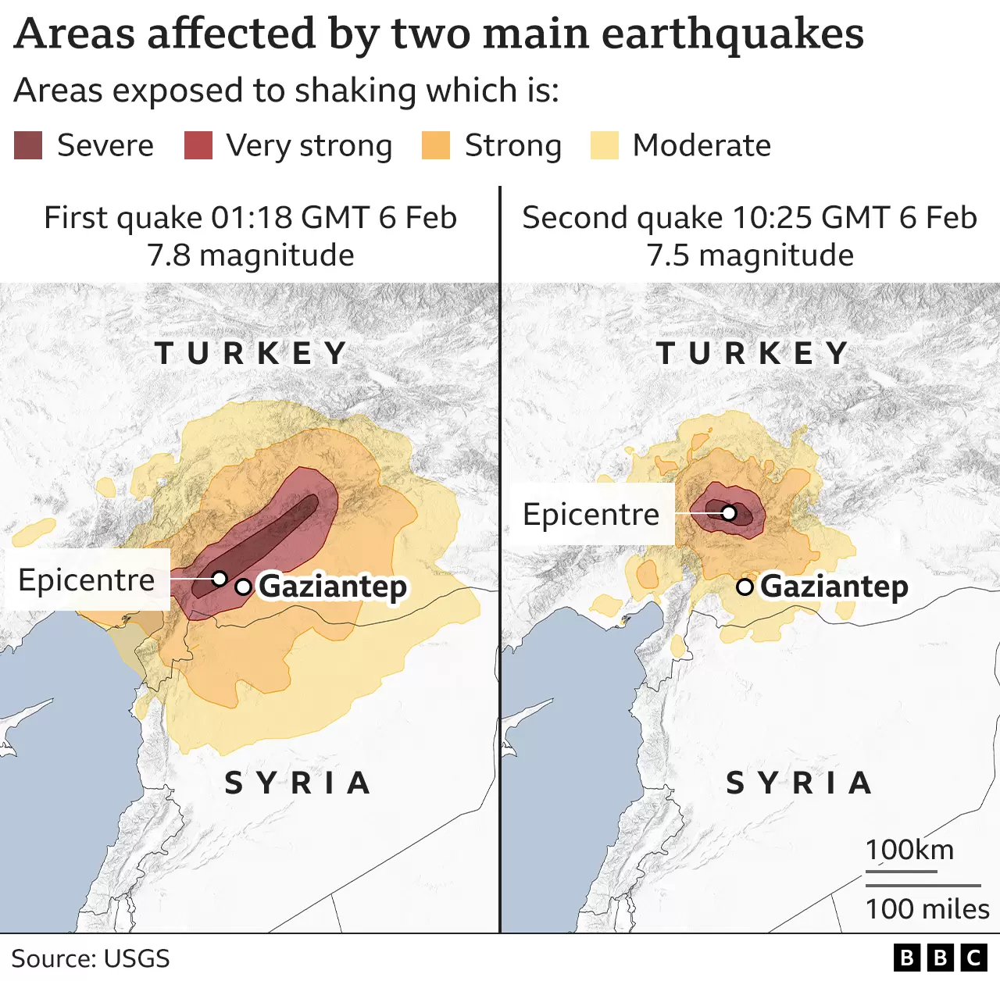
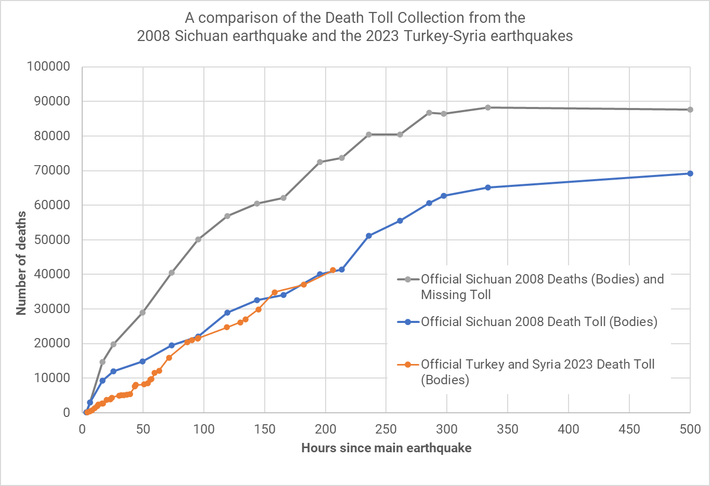
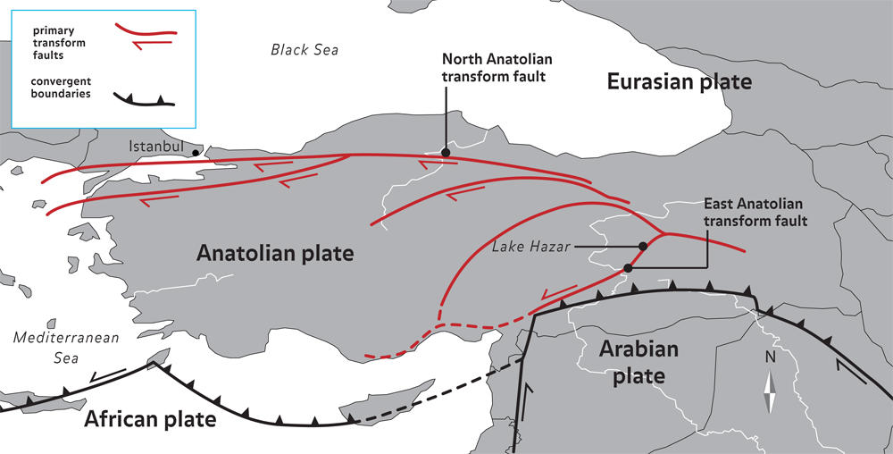
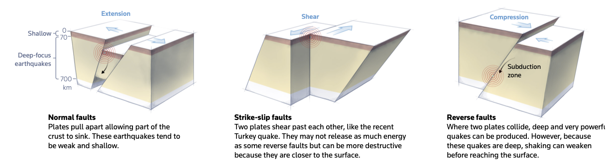
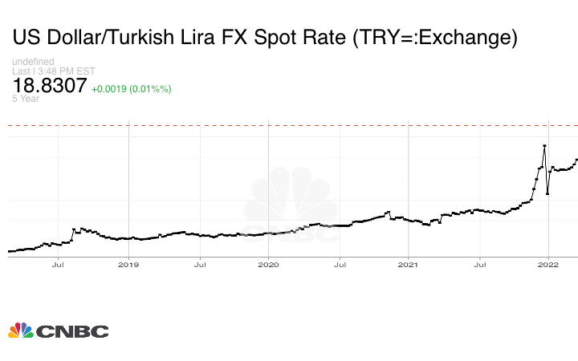
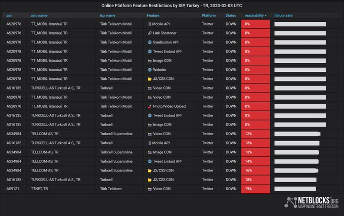

Two catastrophic earthquakes hit southern Turkey and northern Syria on February 6, 2023.
A massive earthquake of 7.8 magnitude was followed by another equally devastating quake within hours.
Here is a map showing the extent of areas impacted by these events from the [BBC](https://www.bbc.com/news/science-environment-64540696).

In this blog , I will focus on Turkey, but my heart also goes to the victims in Syria who have tremendously suffered in a civil war and became refugees. There was very little help provided to these communities and we should not forget them.
The earthquakes in southern Turkey have been extremely devastating. They already took tens of thousands of lives and will cause billions of dollars in economic damage.
The political, social, and psychological consequences will also be significant.

According to a German independent think tank, [Risklayer](http://www.risklayer.com/en/),  the estimated death toll could be more than 50 thousand casualties in Turkey and Syria.Their prediction is based on the *CATDAT* disaster dataset and the scientific work of Daniell et al as described [here](http://www.eaee.org/Media/Default/2ECCES/2ecces_eaee/1400.pdf).
According to the  [Risklayer](http://www.risklayer.com/en/) estimates, the current trajectory of the estimated deaths follow a similar pattern to the 2008 *Sichuan* earthquake.
Here is a chart showing their predictions as of February 14. It is likely that the official estimates will be lower than the predicted model, given the political incentives for under-reporting. Add to this the missing bodies (grey line), unreported fatalities in Syria, among the refugee communities and rural areas, and deaths from secondary complications (injuries, suicides, etc.) and you will get the picture. **Sad and truly catastrophic!**

Daniell et al's model accounts for many factors including the type of the earthquake, physical conditions, previous disaster history, seismic code compliance, and political factors like corruption. So, it would be wise to first look at the science of earthquakes and then examine the political factors to get the full picture about the unfortunate death toll.

First, let's look at why earthquakes are so frequent in Turkey. Turkey is commonly described as a country at the cross-reads in geopolitical terms. It is sitting at the intersection of three continents, it is a bridge from Asia to Europe. Turkey also happens to be the land of earthquakes.
The earthquakes have something to do with its location. Three major plates, African, Arabian, and Eurasian, meet with the relatively small Anatolian plate in Turkey. The movement of these plates that put immense pressure on the Anatolian plate from multiple directions is the root cause of the catastrophic seismic events. Due to this intersectional location, Turkey also sits on on major fault lines. These are some of the most active fault lines on Earth. This map from the [American Museum of Natural  History](https://www.amnh.org/exhibitions/permanent/planet-earth/why-are-there-ocean-basins-continents-and-mountains/plate-tectonics/when-plates-move-past-each-other/anatolian-fault-turkey) nicely captures the extent of the danger. There are many other maps circulating on the net with better aesthetics, but this one shows both the plates and major fault lines.

Second, we need to look at the characteristics of the earthquakes along these lines.
I am not a geologist or an earthquake scientist, so my discussion here will rely on secondary sources. I found this report by the [Reuters](https://www.reuters.com/graphics/TURKEY-QUAKE/zdvxdngmzvx/) very helpful.
As the figure below shows, there are three types of fault lines that may cause earthquakes: normal, strike-slip, and reverse.

 

In normal faults, the two plates move apart causing the crust to sink (extension). In reverse lines, the two plates collide (compression). For the former, earthquakes are usually weak and shallow wheres in the latter earthquakes are powerful but they occur in the deep to reduce its impact on the surface. The middle panel shows the strike-slip fault lines where the two plates shear past each other. This kind of earthqueas can be destructive because they tend to be closer to the surface. 

Turkey's earthquakes are strike-slip just like the famous San Andreas Fault in California.
According to the [USGS](https://earthquake.usgs.gov/earthquakes/browse/significant.php), the 7.8 magnitude earthquake in Nurdagi occured at 17.9 km and the second 7.5 magnitude quake in Ekinözü occured at 10 km depth. The distance of movements to the surface likely contributed to the devastation and death toll. However, this was not the only factor creating the sheer damage and unbearable loss of life. An equally important factor, if not more important, is the politics. Politics has consequences and it may kill. Here is how:

In an earthquake, politics may kill in two ways. First, politics may maintain a corrupt and rent-based system preventing the implementation of cautionary measures in the face of a disaster. Second, a government may fail to immediately and efficiently act on the ground to ease the burden of the disaster. Both paths from politics to death concern quality of government. [This article](https://www.nature.com/articles/469153a) in **Nature** by Nicholas Ambraseys and Roger Bilham finds that corruption kills. Their analysis reveals that "83% of all deaths from building collapse in earthquakes over the past 30 years occurred in countries that are anomalously corrupt" (p.153). [Daniell et al](http://www.eaee.org/Media/Default/2ECCES/2ecces_eaee/1400.pdf) come to a similar conclusion but they also account for the quality of institutions and human development as additional factors explaining the earthquake-related deaths. These political factors matter, because they determine the degree of success in implementation of earthquake-resistant building codes.

Turkey has an advanced seismic building code but it is not strictly enforced. Widespread corruption from national to local levels results in lax implementation practices, issuance of fake reports bought with bribes, and lack of judicial control. Political incentives exacerbate these outcomes. In Turkey, governments issue zoning amnesties (**immar affi** in Turkish) in almost every election cycle contributing to the building code violations and the high number non-safe building stock. [This video](https://v.duvarenglish.com/storage/files/videos/2023/02/12/erdogan-in-2019-daki-imar-barisiyl-I2wU.mp4) made rounds in social media. It shows President Erdogan's enthusiastic endorsement of zoning forgiveness in Kahramanmaraş also known as Maraş, the epicenter of the latest earthquake. In the video, he says, "we solved the problem of 144,156 citizens of Maraş with zoning amnesty," clearly endorsing unsafe building projects risking millions of lives.
[In this study](https://www.sciencedirect.com/science/article/abs/pii/S0267726121005510#abs0010), Kelam and her colleagues found that only 11 percent of the buildings in Gaziantep were fully compliant with earthquake resistant building code and design. Gaziantep, a major city in southern Turkey, was also badly damaged during the twin earthquakes due to its proximity to the fault lines and as this study shows mostly because of the unsafe building stock.
[Kelam et al](https://www.sciencedirect.com/science/article/abs/pii/S0267726121005510#abs0010) also find that 50.6 percent of the building stock in Gaziantep were partially and 38.3% were not compliant at all, an alarming figure. They also predict that in a scenario where two earthquakes with a magnitude of 6.5 and 6.6 hit the nearby fault lines, the outcome will be catastrophic. Unfortunately, time proved them right, only with a more significant catastrophe. Years of corruption, profit driven business practices, and electorally motivated amnesties were the primary factors adding to the toll.

We should also acknowledge the role of business-government relations during the AKP era which are based on profit-driven crony relations. The construction sector was the at the center of a wild and rapid economic development model propagated by Erdogan and happily accepted by a new class of bourgeoisie dependent on the state. See, [Ayşe Buğra and Osman Savaşkan. New Capitalism in Turkey](https://www.cambridge.org/core/journals/new-perspectives-on-turkey/article/abs/ayse-bugra-osman-savaskan-new-capitalism-in-turkey-the-relationship-between-politics-religion-and-business-cheltenham-edward-elgar-publishing-2014-xi-208-pages/DF7A1260F0CC09C367CCB06E46B2CFD2), for an in-depth explanation of business-politics relations.

Second, politics may kill when a government fails to act in a timely and efficient manner against a disaster. We have many examples of such failures in recent disasters like the catastrophic 2022 flooding in Pakistan, the 2022 hurricane in Puerto Rico, and the 7.0 magnitude earthquake in Haiti in 2010. The floods in Pakistan hit the country at the worst time when country was in the midst of political turmoil and economic decline.
This [Brookings report](https://www.brookings.edu/blog/future-development/2023/02/10/pakistan-floods/) states, "the floods submerged one-third of the country in water, 15,000 people were dead or injured and 8 million were displaced. Over 2 million homes, 13,000 kilometers of highways, 439 bridges, and more than 4 million acres of agricultural land were destroyed or damaged." The government response in Pakistan was extremely weak and inefficient. Like Pakistani floods, the twin earthquakes hit Turkey at the worst possible time. According to the [official figures from the Turkish Statistical Agency](https://data.tuik.gov.tr/Bulten/Index?p=Tuketici-Fiyat-Endeksi-Aralik-2022-49651), the inflation hit 84 percent in November 2022. Turkish Lira plummeted against the USD as evidenced in the chart below (reported by [CNBC](https://www.cnbc.com/quotes/TRY=)).

 

Things have not been brighter on the political front. An increasingly authoritarian and incompetent government --within a newly established presidential system-- lost its purpose and became dysfunctional. The approaching presidential elections created much controversy while also accelerating the curtailment of political and civil rights. Opposition coordination was underway but it was slow, unorganized, and lacked credibility. The primary ethnic party (HDP), the third largest party in the system, was excluded from the political processes. The rule of law has been eroded as judiciary turned into an agent of the presidency in the new system. Government's inability to navigate the refugee crisis and economic decline was indicative of its political incompetence. Observers of Turkish politics will probably list a dozen other factors, but it will suffice to say that Turkish politics broke and has been in a state of freefall since the notorious coup attempt of July 15, 2016.

Then the moment of truth arrived, on a cold February morning.The twin earthquakes exposed the shallowness of Erdogan's "Turkish Century" vision and crushed it to the ground, but unfortunately with thousands of lives. The king was naked or as the famous Turkish expression says "takke düştü kel göründü" (someone's true colors revealed). The government was as slow, inefficient, incapable, and distant as it could be. Years of corruption, dismantling of state structures, and erosion of democratic institutions resulted in a colossal government failure, which could not deal with this catastrophe. There has been numerous reports on the ground from the reporters, volunteers, and people about state's absence on the scene, unanswered screams of help under the rubble, and hopelessness. The newly minted disaster management agency, AFAD, could not act in a timely and efficient manner. There was a lack of coordination and total chaos on the ground. State remained under the rubble, some said. [This twitter thread](https://twitter.com/cobanodeccaltes/status/1625099528520040450), as many others, demonstrate  the severity of the situation. The situation in Adiyaman and Hatay provinces was particularly dire. Many eyewitnesses, including volunteers, party leaders, and mayors took on social media to show the destruction and state's absence in the disaster zone, even in the third day of the earthquakes. People were more desperate in sub-provinces and rural areas. To make things worse, the government refused to deploy the armed forces despite repeated calls. In the 1999 earthquake, the armed forces proved to be quick, efficient, and resilient in rescue operations. Only a small number of Turkish soldiers based in Northwest Syria were ordered to Hatay in the twin earthquakes, but they remained inadequate because the much-needed equipment was missing. It also looked like mega projects failed when they were needed the most as the Hatay airport and major highways leading to the disaster zone were destroyed. This is an indication of the extent of corruption in construction sector, which also spread to infrastructure projects. So, it was corruption and gaovernment's failure to intervene in a timely and decisive manner that increased the death toll.

The  decay in Turkish politics became more visible in Erdogan's response. In his first and belated media appearance, Erdogan was angry. In the second, he threatened those who "engage in politics" in times of crisis. Furthermore, the Turkish government restricted access to social media which has been the only means of communication and coordination on the ground. But, it also exposed the government's vulnerability and weakness. So, Erdogan's solution was to close or slow down the internet access (see the chart below). A massive reaction forced the government's hand into restoring it about 12 hours later. 

 

Social scientists will study this disaster and its consequences for many years to come. For example, the disasters can be consequential for elections, social cohesion, civil society, and mental health. There is much to say, but I can finish this post with a positive note. While politics failed, humanity rose. The extent of help, volunteering, and civil society activism restored my faith in people's power. Furthermore, despite all the polarizing rhetoric, Turkish people, from all walks of life, came together in solidarity. Meanwhile, international community rushed to help, even countries that were presented as enemies of Turkish people by the Erdogan regime. Thus, the disaster response from the Turkish people and international community has undermined the divisive political strategies. A sign giving me hope that change might be finally underway. 

